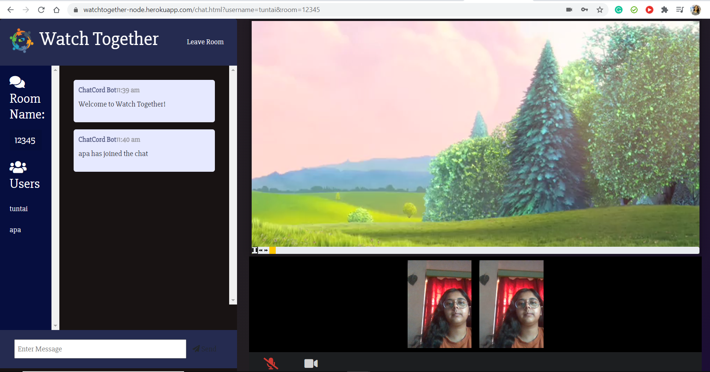

# Watch-Together_Webapp
Watch Video content with all your friends synchronously, Add as many friends as you want to your Watch Together room, chat and video call with all of them at once.
## Features :sparkles:
- :film_projector: Watch Video content with all your friends synchronously. Every member can initiate any video, start, pause and seek time synchronously.
- 	:calling: Video/Audio call with your friends while watching your favourite films and videos.
- 	:handshake: Host a watch party at Watch together and share the room id with all your friends and chill!
- 	💬 : Option available for simple text chatting with the members of the room.
- 	:tada: Host your next Watch-Party and virtual hangout on Watch-Together!! :partying_face:

## Technologies Used :hammer_and_wrench:
 - :construction: Back-End: Node.js, Express.js
 - :computer: Front-End: Bootstrap, Html5, Css3, JavaScript
 - :gear: socket.io, peer.js, websocket, webrtc

### <a href="https://watchtogether-node.herokuapp.com/" target="blank">:arrow_forward: Give it a try!!</a>

## ScreenShots :camera_flash:
 
<hr> 

## To run this web-app in your local systems :computer:

### 1. Pre-requisites:
  - npm
  - node.js (Install node.js server from https://nodejs.org/en/download/)
### 2. Clone this Repo :
```sh
git clone git@github.com:Tuntai/Watch-Together_Webapp.git
```
You can also download the folder and extract all the files in your local system.<br>
Open your IDE install the requirements.

### 3. Install local npm dependencies : 
```sh
npm install
```
### 4. Run server:
```sh
npm start
```
**Now Nevigate to *localhost:3000***
<hr> 

*Made with ❤️ by team Two_wheeler*
